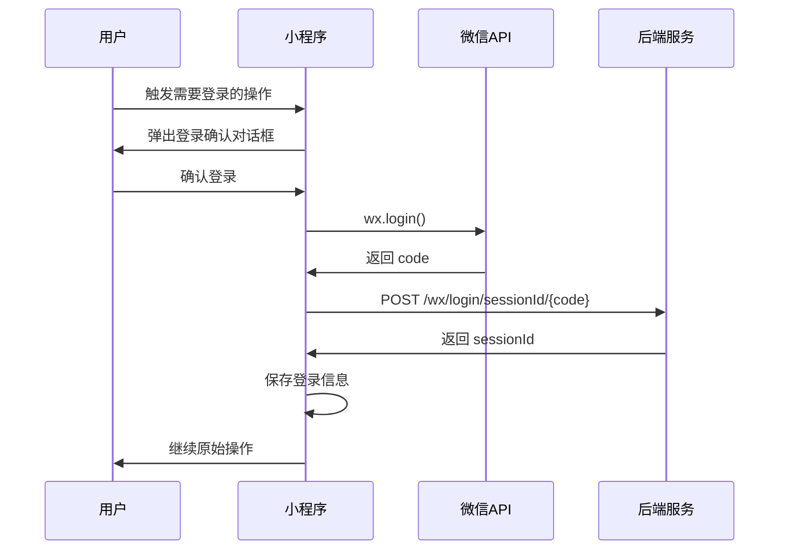

# 知识库管理与对话助手 - 项目设计概览

## 📋 项目概述

### 项目背景
本项目是一个基于微信小程序的知识库管理与智能对话系统，仿照RAGFlow前端的核心功能，为用户提供轻量级、高效的知识管理和AI对话体验。

### 核心价值
- 🎯 **知识管理**: 创建、编辑、删除知识库，支持文档上传和管理
- 🤖 **智能对话**: 基于选定知识库的AI助手对话功能
- 📱 **移动优先**: 充分利用微信小程序的便携性和易用性
- 🔐 **微信生态**: 集成微信登录，无缝融入微信生态系统

## 🏗️ 系统架构

### 整体架构图
```
┌─────────────────────────────────────────────────────────┐
│                    微信小程序前端                        │
├─────────────────────────────────────────────────────────┤
│  页面层 (Pages)                                         │
│  ├── 知识库列表页 (home)                                │
│  ├── 知识库详情页 (knowledge-detail)                    │
│  ├── 对话页面 (chat)                                    │
│  └── 个人中心页 (profile)                               │
├─────────────────────────────────────────────────────────┤
│  组件层 (Components)                                    │
│  ├── TDesign UI 组件库                                  │
│  ├── Markdown 解析器                                    │
│  └── 自定义业务组件                                     │
├─────────────────────────────────────────────────────────┤
│  工具层 (Utils)                                         │
│  ├── API 接口封装                                       │
│  ├── 微信登录管理                                       │
│  ├── 数据存储管理                                       │
│  └── Markdown 解析工具                                  │
├─────────────────────────────────────────────────────────┤
│  数据层 (Data)                                          │
│  ├── 本地存储 (Storage)                                 │
│  ├── 全局状态 (GlobalData)                              │
│  └── 缓存管理                                           │
└─────────────────────────────────────────────────────────┘
                            │
                            │ HTTP API
                            ▼
┌─────────────────────────────────────────────────────────┐
│                    RAGFlow 后端服务                     │
│  ├── 知识库管理 API                                     │
│  ├── 对话管理 API                                       │
│  ├── 文档上传 API                                       │
│  └── 微信登录 API                                       │
└─────────────────────────────────────────────────────────┘
```

### 技术栈
- **前端框架**: 微信小程序原生开发
- **UI组件库**: TDesign for 微信小程序
- **状态管理**: 微信小程序原生 + 全局数据管理
- **网络请求**: wx.request 封装
- **数据存储**: wx.storage (本地存储)
- **富文本渲染**: 自研 Markdown 解析器 + rich-text 组件

## 📱 页面设计

### 1. 知识库列表页 (home)
**功能定位**: 项目入口，展示用户的所有知识库

#### 核心功能
- 📚 知识库列表展示
- ➕ 创建新知识库
- 🔍 知识库搜索和筛选
- 📊 知识库统计信息

#### 设计亮点
```javascript
// 页面数据结构
data: {
  knowledgeBases: [],      // 知识库列表
  loading: false,          // 加载状态
  searchKeyword: '',       // 搜索关键词
  showCreateDialog: false  // 创建对话框状态
}
```

#### 交互流程
1. 页面加载 → 检查登录状态 → 获取知识库列表
2. 用户点击知识库 → 跳转到详情页
3. 用户点击创建 → 弹出创建对话框 → 提交创建请求

### 2. 知识库详情页 (knowledge-detail)
**功能定位**: 知识库的详细管理界面

#### 核心功能
- 📝 知识库信息编辑
- 📄 文档列表管理
- ⬆️ 文档上传功能
- 🗑️ 文档删除功能
- 🤖 启动对话功能

#### 技术特色
```javascript
// 分块上传实现
uploadChunks(filePath, fileId, chunkSize, totalChunks, knowledgeBaseId) {
  // 大文件分块上传逻辑
  // 支持断点续传和进度显示
}
```

#### 设计模式
- **状态管理**: 统一的加载状态和错误处理
- **用户体验**: 实时进度反馈和操作确认
- **数据同步**: 操作后自动刷新数据

### 3. 对话页面 (chat)
**功能定位**: 核心对话功能，支持Markdown渲染

#### 核心功能
- 💬 实时对话交互
- 🎨 Markdown 内容渲染
- 📚 知识库助手切换
- 💾 对话历史管理
- 🔄 流式消息处理

#### 技术创新
```javascript
// Markdown 解析集成
processMessageContent(content) {
  // 处理 <think> 标签
  // 格式化引用编号
  // 解析 Markdown 内容
  return {
    content: processedContent,
    richNodes: parseMarkdown(processedContent)
  };
}
```

#### 视觉设计
- **消息气泡**: 渐变背景，现代化圆角设计
- **代码高亮**: 专业的代码块样式
- **引用样式**: 优雅的引用块设计
- **列表格式**: 清晰的有序/无序列表

### 4. 个人中心页 (profile)
**功能定位**: 用户信息管理和系统设置

#### 核心功能
- 👤 用户信息展示
- 🔐 微信登录管理
- ⚙️ 系统设置入口
- 📊 使用统计信息

## 🔧 核心技术实现

### 1. Markdown 解析系统

#### 架构设计
```javascript
class MarkdownParser {
  constructor() {
    this.rules = {
      heading: /^(#{1,6})\s+(.+)$/gm,
      bold: /\*\*(.*?)\*\*|__(.*?)__/g,
      italic: /\*(.*?)\*|_(.*?)_/g,
      // ... 更多规则
    };
  }
  
  parse(markdown) {
    // 预处理 → 解析 → 生成节点
    return nodes;
  }
}
```

#### 支持的格式
- ✅ 标题 (H1-H6)
- ✅ 文本格式 (粗体、斜体、删除线)
- ✅ 代码块和行内代码
- ✅ 列表 (有序、无序)
- ✅ 引用块
- ✅ 链接和图片
- ✅ 水平分割线

#### 渲染效果
- 🎨 **代码块**: 渐变背景 + 蓝色边框 + 语法标识
- 📝 **标题**: 分级字体大小 + 下划线装饰
- 💬 **引用**: 蓝色渐变背景 + 装饰引号
- 🔗 **链接**: 蓝色文字 + 下划线效果

### 2. 微信登录系统

#### 登录流程


#### 特色功能
- 🔐 **手动确认**: 用户主动确认登录，避免强制登录
- ⏰ **自动续期**: 7天有效期，自动检查和续期
- 💾 **状态管理**: 全局登录状态同步
- 🔄 **错误恢复**: 登录失败自动重试机制

### 3. API 接口管理

#### 接口封装
```javascript
// 统一的API接口管理
const api = {
  knowledgeBaseApi: {
    getList: () => request('/knowledge-bases'),
    create: (data) => request('/knowledge-bases', 'POST', data),
    update: (id, data) => request(`/knowledge-bases/${id}`, 'PUT', data),
    delete: (id) => request(`/knowledge-bases/${id}`, 'DELETE')
  },
  chatAssistantApi: {
    getList: () => request('/chat/assistants'),
    createSession: (data) => request('/chat/sessions', 'POST', data),
    sendMessage: (data) => request('/chat/messages', 'POST', data)
  }
  // ... 更多接口
};
```

#### 请求拦截器
- 🔐 **自动登录**: 请求前自动检查登录状态
- ⚡ **加载状态**: 统一的loading管理
- 🚨 **错误处理**: 统一的错误提示和处理
- 🔄 **重试机制**: 网络失败自动重试

### 4. 数据存储策略

#### 存储层次
```javascript
// 三层存储架构
1. 内存层 (页面data) - 临时数据，页面级别
2. 全局层 (globalData) - 应用级别，跨页面共享
3. 持久层 (storage) - 本地存储，应用重启保持
```

#### 数据同步
- 📱 **实时同步**: 操作后立即更新所有相关页面
- 💾 **本地缓存**: 关键数据本地缓存，提升体验
- 🔄 **增量更新**: 只更新变化的数据，减少网络请求

## 🎨 UI/UX 设计

### 设计原则
1. **简洁优雅**: 遵循微信设计规范，界面简洁清晰
2. **一致性**: 统一的色彩、字体、间距系统
3. **响应式**: 适配不同屏幕尺寸和设备
4. **可访问性**: 考虑视觉障碍用户的使用需求

### 色彩系统
```css
/* 主色调 */
--primary-color: #0052d9;      /* 微信蓝 */
--primary-light: #e3f2fd;      /* 浅蓝色 */
--primary-dark: #1976d2;       /* 深蓝色 */

/* 辅助色 */
--success-color: #00a870;      /* 成功绿 */
--warning-color: #ed7b2f;      /* 警告橙 */
--error-color: #e34d59;        /* 错误红 */

/* 中性色 */
--text-primary: #2d3748;       /* 主要文字 */
--text-secondary: #4a5568;     /* 次要文字 */
--text-disabled: #a0aec0;      /* 禁用文字 */
--background: #f8fafc;         /* 背景色 */
```

### 组件设计
- **消息气泡**: 渐变背景 + 阴影效果 + 圆角设计
- **按钮系统**: 多种状态和尺寸，统一的交互反馈
- **表单组件**: 清晰的标签和验证提示
- **加载状态**: 优雅的骨架屏和加载动画

## 🚀 性能优化

### 1. 代码优化
- **按需加载**: 页面级别的代码分割
- **图片优化**: WebP格式 + 懒加载
- **缓存策略**: 合理的缓存机制

### 2. 网络优化
- **请求合并**: 减少不必要的网络请求
- **数据压缩**: 启用gzip压缩
- **CDN加速**: 静态资源CDN分发

### 3. 渲染优化
- **虚拟列表**: 大列表性能优化
- **防抖节流**: 用户输入优化
- **内存管理**: 及时清理不需要的数据

## 🔒 安全设计

### 1. 数据安全
- **敏感信息**: 不在本地存储敏感数据
- **传输加密**: HTTPS + 数据加密
- **输入验证**: 前端输入验证和后端验证

### 2. 用户隐私
- **权限最小化**: 只申请必要的权限
- **数据透明**: 明确告知数据使用目的
- **用户控制**: 用户可以控制数据的使用

## 📊 监控与分析

### 1. 性能监控
- **页面加载时间**: 监控各页面加载性能
- **API响应时间**: 监控接口响应速度
- **错误率统计**: 统计和分析错误情况

### 2. 用户行为
- **页面访问**: 统计页面访问情况
- **功能使用**: 分析功能使用频率
- **用户路径**: 分析用户使用路径

## 🔮 未来规划

### 短期目标 (1-3个月)
- 🎯 **功能完善**: 补充缺失的功能模块
- 🐛 **Bug修复**: 修复已知问题和优化体验
- 📱 **适配优化**: 更好的设备适配

### 中期目标 (3-6个月)
- 🤖 **AI增强**: 更智能的对话功能
- 📊 **数据分析**: 用户行为分析和推荐
- 🔗 **生态集成**: 与更多微信生态产品集成

### 长期目标 (6-12个月)
- 🌐 **多端支持**: 支持更多平台
- 🏢 **企业版**: 面向企业用户的功能
- 🔌 **开放平台**: 提供API给第三方开发者

## 📚 开发指南

### 环境搭建
1. 安装微信开发者工具
2. 克隆项目代码
3. 配置后端API地址
4. 导入项目到开发者工具

### 代码规范
- **命名规范**: 使用驼峰命名法
- **文件组织**: 按功能模块组织文件
- **注释规范**: 关键逻辑添加注释
- **代码格式**: 使用ESLint统一代码格式

### 调试技巧
- **控制台调试**: 使用console.log调试
- **网络调试**: 查看网络请求和响应
- **存储调试**: 检查本地存储数据
- **真机调试**: 在真机上测试功能

---

## 📝 总结

本项目是一个功能完整、设计精美的微信小程序，展现了现代前端开发的最佳实践：

1. **技术创新**: 自研Markdown解析器，提供优秀的富文本体验
2. **用户体验**: 精心设计的UI和流畅的交互
3. **架构设计**: 清晰的分层架构和模块化设计
4. **工程化**: 完善的开发流程和代码规范

项目不仅实现了预期的功能需求，更在技术实现和用户体验方面有所创新，为微信小程序开发提供了优秀的参考案例。 