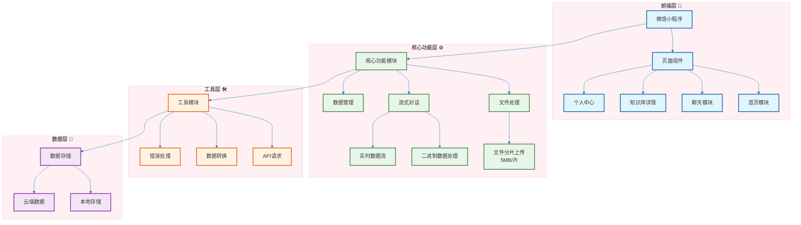
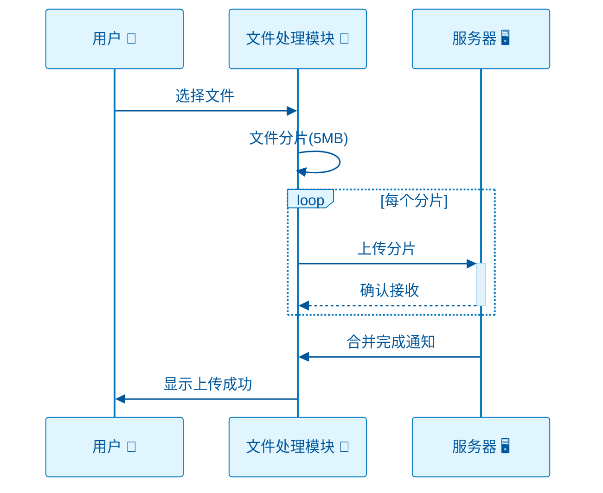
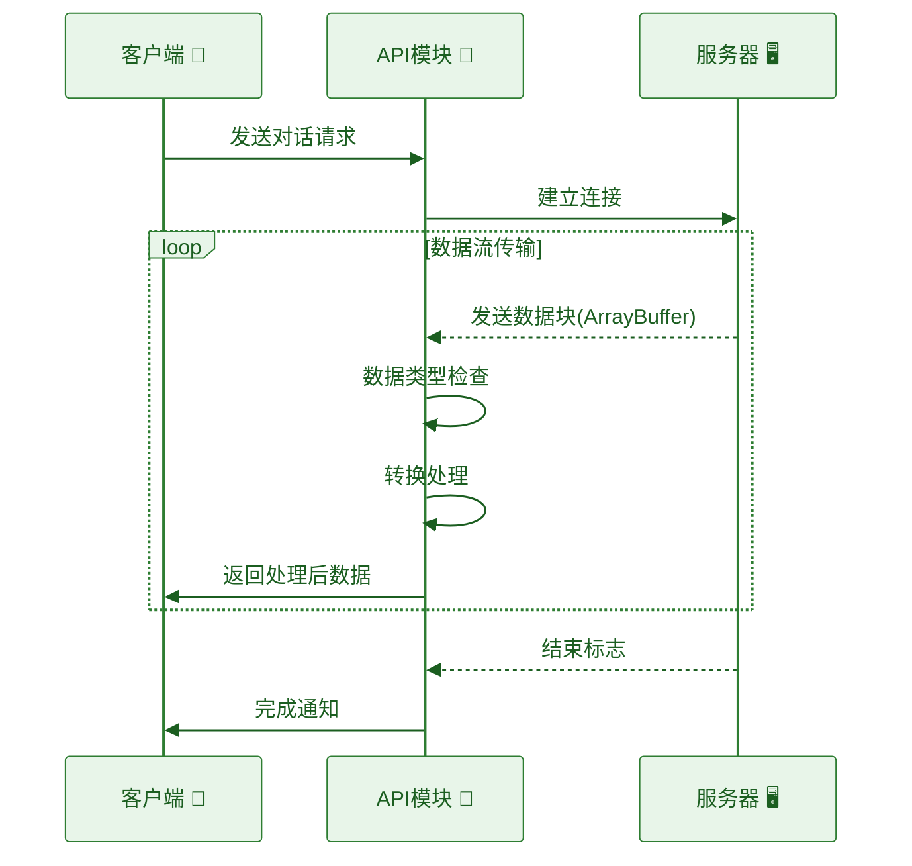
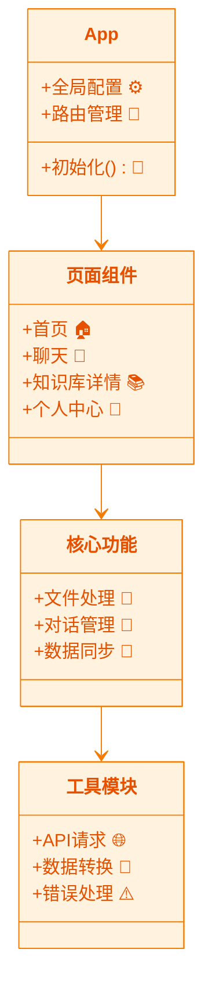

# 小程序系统架构图

## 整体架构

```mermaid
%%{init: {'theme': 'base', 'themeVariables': { 'primaryColor': '#f0f7ff', 'primaryTextColor': '#333', 'primaryBorderColor': '#2980b9', 'lineColor': '#2980b9', 'secondaryColor': '#fdf5e6', 'tertiaryColor': '#fff0f4'}}}%%
graph TB
    %% 定义样式
    classDef frontEnd fill:#e1f5fe,stroke:#01579b,stroke-width:2px
    classDef coreModule fill:#e8f5e9,stroke:#2e7d32,stroke-width:2px
    classDef toolModule fill:#fff3e0,stroke:#e65100,stroke-width:2px
    classDef dataModule fill:#f3e5f5,stroke:#7b1fa2,stroke-width:2px
    
    subgraph 前端层["前端层 📱"]
        A[微信小程序] --> B[页面组件]
        B --> B1[首页模块]
        B --> B2[聊天模块]
        B --> B3[知识库详情]
        B --> B4[个人中心]
    end
    
    subgraph 核心功能层["核心功能层 ⚙️"]
        C[核心功能模块] --> C1[文件处理]
        C --> C2[流式对话]
        C --> C3[数据管理]
        C1 --> C1_1[文件分片上传<br/>5MB/片]
        C2 --> C2_1[二进制数据处理]
        C2 --> C2_2[实时数据流]
    end
    
    subgraph 工具层["工具层 🛠️"]
        D[工具模块] --> D1[API请求]
        D --> D2[数据转换]
        D --> D3[错误处理]
    end
    
    subgraph 数据层["数据层 💾"]
        E[数据存储] --> E1[本地存储]
        E --> E2[云端数据]
    end

    A --> C
    C --> D
    D --> E

    %% 应用样式
    class A,B,B1,B2,B3,B4 frontEnd
    class C,C1,C2,C3,C1_1,C2_1,C2_2 coreModule
    class D,D1,D2,D3 toolModule
    class E,E1,E2 dataModule
```

## 文件处理流程

```mermaid
%%{init: {'theme': 'base', 'themeVariables': { 'primaryColor': '#e1f5fe', 'primaryTextColor': '#01579b', 'primaryBorderColor': '#0277bd', 'lineColor': '#0277bd', 'secondaryColor': '#e3f2fd', 'tertiaryColor': '#bbdefb'}}}%%
sequenceDiagram
    participant U as 用户 👤
    participant F as 文件处理模块 📁
    participant S as 服务器 🖥️
    
    U->>F: 选择文件
    F->>F: 文件分片(5MB)
    loop 每个分片
        F->>+S: 上传分片
        S-->>-F: 确认接收
    end
    S->>F: 合并完成通知
    F->>U: 显示上传成功
```

## 流式对话处理

```mermaid
%%{init: {'theme': 'base', 'themeVariables': { 'primaryColor': '#e8f5e9', 'primaryTextColor': '#1b5e20', 'primaryBorderColor': '#2e7d32', 'lineColor': '#2e7d32', 'secondaryColor': '#f1f8e9', 'tertiaryColor': '#dcedc8'}}}%%
sequenceDiagram
    participant C as 客户端 📱
    participant A as API模块 🔌
    participant S as 服务器 🖥️
    
    C->>A: 发送对话请求
    A->>S: 建立连接
    loop 数据流传输
        S-->>A: 发送数据块(ArrayBuffer)
        A->>A: 数据类型检查
        A->>A: 转换处理
        A->>C: 返回处理后数据
    end
    S-->>A: 结束标志
    A->>C: 完成通知
```

## 系统组件关系

```mermaid
%%{init: {'theme': 'base', 'themeVariables': { 'primaryColor': '#fff3e0', 'primaryTextColor': '#e65100', 'primaryBorderColor': '#f57c00', 'lineColor': '#f57c00', 'secondaryColor': '#fff8e1', 'tertiaryColor': '#ffecb3'}}}%%
classDiagram
    class App {
        +初始化() 🚀
        +全局配置 ⚙️
        +路由管理 🔄
    }
    
    class 页面组件 {
        +首页 🏠
        +聊天 💬
        +知识库详情 📚
        +个人中心 👤
    }
    
    class 核心功能 {
        +文件处理 📁
        +对话管理 💭
        +数据同步 🔄
    }
    
    class 工具模块 {
        +API请求 🌐
        +数据转换 🔄
        +错误处理 ⚠️
    }
    
    App --> 页面组件
    页面组件 --> 核心功能
    核心功能 --> 工具模块
``` 